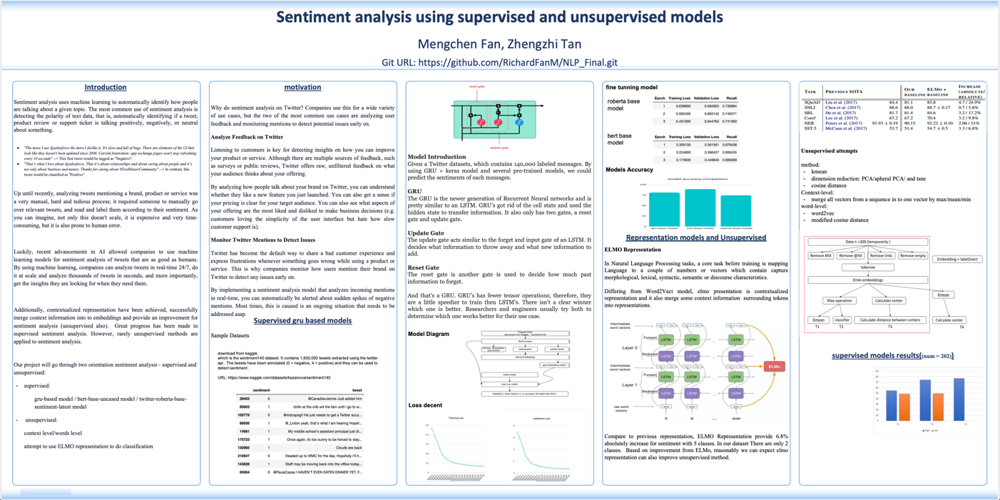
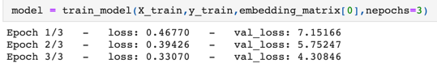
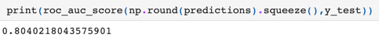
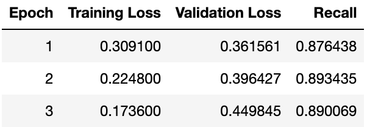
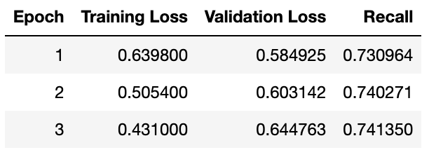

# NLP Final Project

## Project: Twiter Analyzer

## Wirter: Mengchen Fan & Zhengzhi Tan

  ### Overall: 

  ### supervised model: 

  #### Run guide:
    
    - run .ipynb file under notebook, better on CHEAHA.
    - need training.1600000.processed.noemoticon.csv in same root directory with .ipynb file.
    - fine-tune model with GPU. If you don't have GPU, delete the .cuda() for models.

  #### As GRU model:
  
    file name: gru_base_model.ipynb

    function:
        - preprocess_text:
            process data and text and delete @XXX and puncuation.
        - tokenizer:
            tokenize each sentence
        - prepare_matrix:
            generate the corpus matrix for training
        - TweetModel:
            build gru base model
        - TweetDataset:
            generate the training dataset
        - train_model:
            train the gru based model

training process:

training result:

    
  #### As fine-tuning model:
  
    bert based model:
    
      file name: fine_tune_bert_base_model.ipynb
      
      result:

      
    roberta based model:
    
      file name: fine_tune_roberta_base_model.ipynb

      result:

  ##### Fine-tuned bert based model has the highest accuracy
      
   

  ### unsupervised: 

  In train model and preprocessing:
  
    - remove @xxx #xxx url and empty 
    
    - fine tuning elmo and get vectors
    
    - save vector 
    
  In cluster:
  
    - 1 First attempt:
    
      use kmean to cluster 
      
      or reduce dimension the cluster
      
    - 2 Second attempt:
    
      use classifers to classify data
      
    - 3 Third attempt:
    
      create two centers using all vectors
      
      calucuate distances with to center as polarity score
